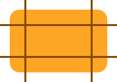

# How to use the Feathers `Scale9Image` display object

The [`Scale9Image`](../api-reference/feathers/display/Scale9Image.html) class displays a texture divided into nine regions. When the dimensions of a `Scale9Image` are changed, the corners will not scale and each of the edges will scale in only one direction. The center region will be scaled in both directions normally. `Scale9Image` allows you to create a shape with features like rounded corners and borders for user interface components like buttons and windows.

## Regions



The image above divides a rounded rectangle into nine regions. The four lines, two horizontal and two vertical, show where the image is sliced. The exact pixel location of these "slices" are easily configurable, as you will see later.

The image below uses arrows to show how each of the regions will scale. Some regions will not scale. Some will scale only horizontally. Some will scale only vertically. Finally, some may scale in both directions.


From this point forward, each region will be named by combining its horizontal and vertical position. Horizontal positions are "left", "center", and "right". Vertical positions are "top", "middle", and "bottom".

The top-left, top-right, bottom-left, and bottom-right regions (the corners) will not be scaled.

The top-center and bottom-center region will scale horizontally. These regions will not scale vertically.

The middle-left and middle-right regions will scale vertically. It will not scale horizontally.

The middle-center region will scale both horizontally and vertically.

## The Grid

A rectangle defines the *grid*. Actually, this rectangle specifically defines the middle-center region described above. Each of the other regions can be automatically calculated using the rectangle and the original width and height of the texture.

The orange rounded rectangle pictured above is `200` pixels wide and `130` pixels tall. Using the lines in the picture, we'll define the scale 9 grid. The x and y values of the rectangle are both `30`. The width of the rectangle is `140` pixels. The height of the rectangle is `70` pixels.

``` code
30 + 140 + 30 = 200
30 + 70 + 30 = 130
```

The left and right regions don't necessarily need to be the same size. Neither do the top and bottom regions. However, for rounded corners, it will often be the case that these regions are the same size.

## Code

First, let's create a [`feathers.textures.Scale9Textures`](../api-reference/feathers/textures/Scale9Textures.html) object:

``` code
var texture:Texture = Texture.fromBitmapData( bitmapData );
var rect:Rectangle = new Rectangle( 30, 30, 140, 70 );
var textures:Scale9Textures = new Scale9Textures( texture, rect );
```

This object is created from a standard [`starling.textures.Texture`](http://doc.starling-framework.org/core/starling/textures/Texture.html) object and the [`flash.geom.Rectangle`](http://help.adobe.com/en_US/FlashPlatform/reference/actionscript/3/flash/geom/Rectangle.html) object that defines the middle center region.

We'll pass the `Scale9Textures` object to a new [`feathers.display.Scale9Image`](../api-reference/feathers/display/Scale9Image.html) object:

``` code
var image:Scale9Image = new Scale9Image( textures );
image.width = 100;
image.height = 100;
this.addChild( image );
```

You can easily change the `width` and `height` properties, and the regions will scale appropriately, as described above.

## Related Links

-   [`feathers.display.Scale9Image` API Documentation](../api-reference/feathers/display/Scale9Image.html)